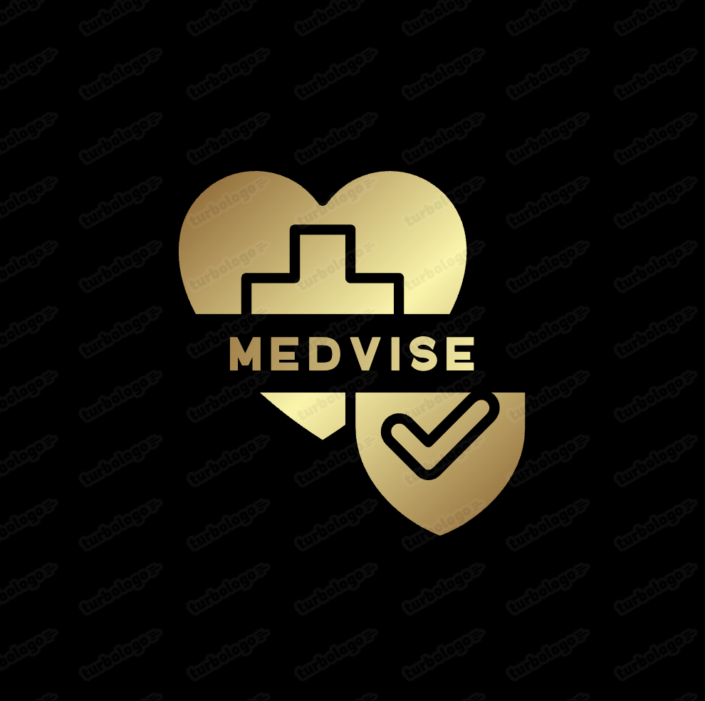
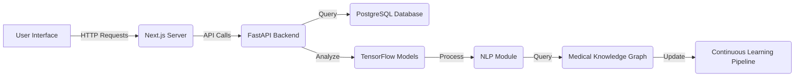

<div align="center">
  

  # MedVise: AI-Powered Medical Assistant

  [](https://nextjs.org/)
  [](https://reactjs.org/)
  [](https://www.tensorflow.org/)
  [](https://fastapi.tiangolo.com/)
  [](https://opensource.org/licenses/MIT)

  Revolutionizing healthcare with AI-driven symptom analysis and personalized health recommendations.


</div>

## 🌟 Features

- 🧠 **AI-Powered Symptom Analysis**: Utilizes advanced machine learning models to interpret user-reported symptoms.
- 📊 **Personalized Health Recommendations**: Provides tailored advice based on individual health profiles.
- 🔍 **Medical Knowledge Graph**: Leverages a comprehensive database of medical relationships for accurate diagnoses.
- 🗣️ **Natural Language Processing**: Understands and processes user inputs in natural language.
- 🔒 **Privacy-First Design**: Ensures user data is encrypted and protected at all times.
- 📱 **Responsive UI**: Seamless experience across desktop and mobile devices.

## 🚀 Quick Start

1. **Clone the repository**
   ```sh
   https://github.com/Tanishka534/medvise.git
   ```

2. **Install dependencies**

   ```sh
   cd medvise
   npm install
   ```

3. **Set up environment variables**

   ```sh
   cp .env.example .env.local
   # Edit .env.local with your configuration
   ```

4. **Run the development server**

   ```sh
   npm run dev
   ```

5. **Open [http://localhost:3000](http://localhost:3000) in your browser**

## 🏷️ Architecture



## 🧠 AI Models

MedVise employs a suite of sophisticated AI models:

1. **Symptom Analysis Engine**: A deep learning model trained on millions of patient records to accurately interpret reported symptoms.
2. **Health Recommendation System**: An ensemble of decision trees that generates personalized health advice.
3. **NLP Module**: Utilizes BERT-based models for understanding complex medical descriptions in natural language.

## 🔒 Security & Privacy

- End-to-end encryption for all data transmissions
- Tokenization of sensitive health data
- Strict access controls and comprehensive audit logs
- HIPAA and GDPR compliant

## 🤝 Contributing

We welcome contributions! Please see our [Contributing Guidelines](CONTRIBUTING.md) for more details.

## 🌜 License

This project is licensed under the MIT License - see the [LICENSE](LICENSE) file for details.

## 🙏 Acknowledgements

- [OpenAI](https://openai.com/) for GPT models used in NLP processing
- [NHS](https://www.nhs.uk/) for providing open-source medical information
- [World Health Organization](https://www.who.int/) for global health data
